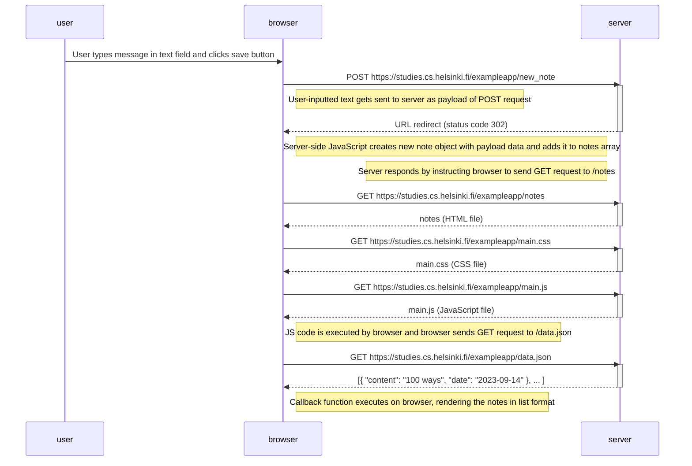

```mermaid
sequenceDiagram
    participant user
    participant browser
    participant server

    user->>browser: User types message in text field and clicks save button

    browser->>server: POST https://studies.cs.helsinki.fi/exampleapp/new_note
    activate server
    Note right of browser: User-inputted text gets sent to server as payload of POST request
    server-->>browser: URL redirect (status code 302)
    deactivate server
    Note left of server: Server-side JavaScript creates new note object with payload data and adds it to notes array 
    Note left of server: Server responds by instructing browser to send GET request to /notes


    browser->>server: GET https://studies.cs.helsinki.fi/exampleapp/notes
    activate server
    server-->>browser: notes (HTML file)
    deactivate server

    browser->>server: GET https://studies.cs.helsinki.fi/exampleapp/main.css
    activate server
    server-->>browser: main.css (CSS file)
    deactivate server

    browser->>server: GET https://studies.cs.helsinki.fi/exampleapp/main.js
    activate server
    server-->>browser: main.js (JavaScript file)
    deactivate server

    Note right of browser: JS code is executed by browser and browser sends GET request to /data.json

    browser->>server: GET https://studies.cs.helsinki.fi/exampleapp/data.json
    activate server
    server-->>browser: [{ "content": "100 ways", "date": "2023-09-14" }, ... ]
    deactivate server

     Note right of browser: Callback function executes on browser, rendering the notes in list format

```