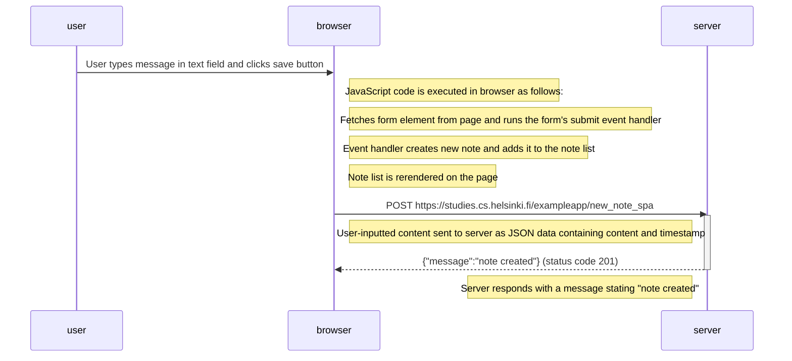

```mermaid
sequenceDiagram
    participant user
    participant browser
    participant server

    user->>browser: User types message in text field and clicks save button

    
    Note right of browser: JavaScript code is executed in browser as follows: 
    Note right of browser: Fetches form element from page and runs the form's submit event handler
    Note right of browser: Event handler creates new note and adds it to the note list
    Note right of browser: Note list is rerendered on the page

    browser->>server: POST https://studies.cs.helsinki.fi/exampleapp/new_note_spa
    activate server
    Note right of browser: User-inputted content sent to server as JSON data containing content and timestamp
    server-->>browser: {"message":"note created"} (status code 201)
    deactivate server
    Note left of server: Server responds with a message stating "note created"
```